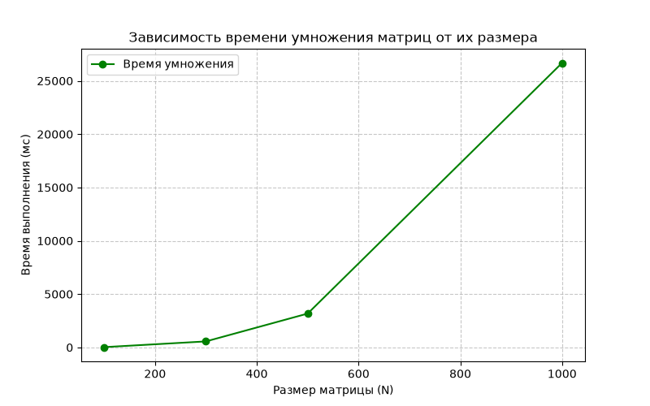

# Отчет по лабораторной работе №1

**Тема:** Умножение квадратных матриц и автоматизированная верификация   
**Студент:** Судаков Антон  
**Группа:** 6211-10.05.03  

## 1. Цель работы
Реализовать алгоритм умножения квадратных матриц на языке C++, провести автоматизированную верификацию результатов с помощью сторонней библиотеки (Python/NumPy) и исследовать зависимость времени выполнения от размера задачи.  

## 2. Задание
1. Написать программу на C++ для перемножения двух квадратных матриц.
2. Входные данные: файлы с матрицами (`Matrix_A.txt`, `Matrix_B.txt`).
3. Выходные данные: файл с результатом (`Result_Matrix.txt`), время выполнения, объем задачи.
4. Провести автоматизированную верификацию через Python.

## 3. Ход работы

### 3.1 Реализация на C++
Программа состоит из следующих функций:
1. `ReaderMatrix` — чтение матрицы из файла (первая строка — размер N).
2. `MultiplyMatrix` — умножение матриц с использованием `i-k-j` порядка.
3.  `WriterMatrix` — запись результата в файл.
4.  `PrintMatrix` — вывод матрицы на экран для отладки.
5.  `main` - основная функция.

Замер времени выполнения производится с помощью библиотеки `<chrono>`.

### 3.2 Автоматизированная верификация на Python
Для проверки корректности вычислений используется Python-скрипт `run_all.py`:
1. Запускает C++ программу через `subprocess`.
2. Считывает результаты из `Result_Matrix.txt`.
3. Считает эталонный результат с помощью `numpy`.
4. Сравнивает результаты с помощью `numpy.allclose()`.

## 4. Результаты эксперимента

Были проведены замеры времени умножения матриц различных размеров.

| Размер матрицы (N x N) | Время выполнения (мс) |
| :--- | :--- |
| 100 x 100 | 25.4332 |
| 300 x 300 | 562.2191 |
| 500 x 500 | 3173.2165 |
| 1000 x 1000 | 26682.5061 |

### График зависимости времени от размера матрицы

